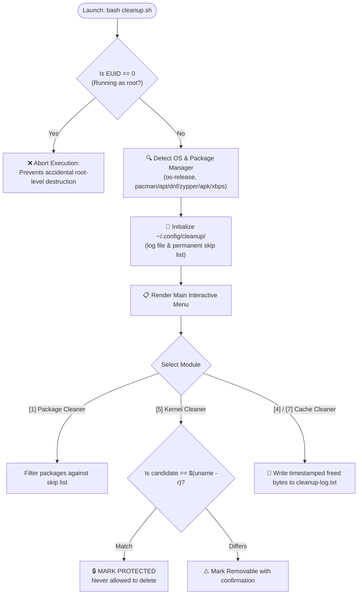

### 🚀 Universal Interactive Linux Cleanup & Storage Optimization Suite
*Delete gigabytes of wasted storage safely, intelligently, and interactively across any Linux distribution.*

---

[-blue?style=for-the-badge&logo=linux&logoColor=white)](https://www.kernel.org/)
[](https://www.gnu.org/software/bash/)
[](LICENSE)
[]()

<br/>

[](https://archlinux.org/)
[](https://www.debian.org/)
[](https://ubuntu.com/)
[](https://fedoraproject.org/)
[](https://www.opensuse.org/)
[](https://alpinelinux.org/)
[](https://voidlinux.org/)

</div>

---

## 📖 Table of Contents

- [🌟 Why Cleanup.sh?](#-why-cleanupsh)
- [⚡ Key Features](#-key-features)
- [🐧 Distribution Support Matrix](#-distribution-support-matrix)
- [🛡️ Safety Guarantees & Architecture](#️-safety-guarantees--architecture)
- [🚀 Quick Start & Installation](#-quick-start--installation)
- [🎛️ Interactive Menu Tour (Modules 0–9)](#️-interactive-menu-tour-modules-09)
  - [`[0] Show System Overview`](#-0-show-system-overview)
  - [`[1] Interactive Package Cleaner`](#-1-interactive-package-cleaner)
  - [`[2] Show Biggest Packages (Top 30)`](#-2-show-biggest-packages-top-30)
  - [`[3] Remove Orphan Packages`](#-3-remove-orphan-packages)
  - [`[4] Selective Cache Cleaner`](#-4-selective-cache-cleaner)
  - [`[5] Clean Old Kernels`](#-5-clean-old-kernels)
  - [`[6] Directory Cleaner`](#-6-directory-cleaner)
  - [`[7] Clean All Caches at Once (Batch)`](#-7-clean-all-caches-at-once-batch)
  - [`[8] Show Cleanup Log`](#-8-show-cleanup-log)
  - [`[9] Manage Skipped Packages`](#-9-manage-skipped-packages)
- [⌨️ Keyboard Shortcuts & Input Syntax](#️-keyboard-shortcuts--input-syntax)
- [📂 Directory Layout & Config](#-directory-layout--config)
- [❓ Frequently Asked Questions (FAQ)](#-frequently-asked-questions-faq)
- [🤝 Contributing](#-contributing)
- [📄 License](#-license)

---

## 🌟 Why Cleanup.sh?

Over weeks and months of daily Linux usage, disks accumulate gigabytes of forgotten data:
- Dormant package manager caches (`/var/cache/...`)
- Hundreds of unneeded orphaned dependencies
- Giant desktop thumbnail caches and user caches (`~/.cache`)
- Massive systemd journal logs stretching back months
- Forgotten, disused Flatpak runtimes and disabled Snap revisions
- Superseded Linux kernel images hogging `/boot` and root partitions
- Cluttered user directories (`~/Downloads`, `~/Videos`, `.thumbnails`)

Many existing cleaning scripts are either **dangerous** (indiscriminately running `rm -rf` without checks), **distro-locked** (hardcoded specifically for Arch, Debian, or Fedora), or **inflexible** (all-or-nothing wipeouts without user consent).

**`cleanup.sh` is built differently:**
1. **100% Distro-Agnostic**: Automatically detects your distribution (`pacman`, `apt`, `dnf`, `zypper`, `apk`, `xbps`, or generic fallback) and issues the native, idiomatic commands.
2. **Safe By Design**: Blocks direct execution as root, protects the currently booted kernel with strict fail-safes, and offers granular confirmation prompts.
3. **Selective vs. Batch Control**: Choose individual items to inspect and clean, or run a comprehensive one-click system purge.
4. **Persistent Ignore Lists**: Mark packages you never want to be asked about again, and manage that ignore list interactively anytime.
5. **Zero External Dependencies**: Runs entirely on standard POSIX/Bash tools (`awk`, `sed`, `find`, `du`, `stat`, `df`).

---

## ⚡ Key Features

| Feature | Description |
| :--- | :--- |
| **Universal OS Detection** | Auto-detects 10+ Linux distributions via `/etc/os-release` and `uname` |
| **Smart Package Inspection** | Analyzes installed software ranked largest-first with live size parsing |
| **Interactive Stepper** | Step forward/backward through packages, view descriptions & dependencies |
| **Orphan Dependency Reaper** | Detects and safely purges unneeded leftover dependencies across package managers |
| **Selective Cache Purge** | Pick and choose exact caches (user, trash, thumbnails, `/tmp`, package caches) |
| **Kernel Fail-Safe Guard** | Keeps active kernel (`uname -r`) protected while identifying obsolete kernels |
| **Dynamic Space Consumers** | Scans `$HOME` and system paths to find directories hogging disk space |
| **Full Audit Trail** | Logs every single reclaimed byte with timestamps to `~/.config/cleanup/cleanup-log.txt` |
| **In-Script Skip Manager** | View, remove, or clear skipped packages directly without opening config files |

---

## 🐧 Distribution Support Matrix

`cleanup.sh` contains zero hardcoded paths or assumptions. It maps operations to the host package manager automatically:

| Distribution Family | Package Manager | Package Queries & Sorting | Orphan Detection | Cache Cleanup | Safe Kernel Cleaner |
| :--- | :---: | :---: | :---: | :---: | :---: |
| **Arch / CachyOS / Manjaro / EndeavourOS** | `pacman` | `pacman -Qi` | `pacman -Qdtq` | `paccache` / `pacman -Sc` / cache dir | Yes (`linux*` vs `uname -r`) |
| **Debian / Ubuntu / Mint / Pop!_OS** | `apt` / `dpkg` | `dpkg-query` + KiB math | `apt-get -s autoremove` | `apt-get clean` / `autoclean` | Yes (`linux-image-*`) |
| **Fedora / RHEL / CentOS / Rocky** | `dnf` / `rpm` | `rpm -qa --queryformat` | `dnf repoquery --unneeded` | `dnf clean all` | Yes (`kernel-core-*`) |
| **openSUSE Leap / Tumbleweed** | `zypper` / `rpm` | `rpm -qa --queryformat` | `zypper packages --unneeded` | `zypper clean --all` | Yes (`kernel-default-*`) |
| **Alpine Linux** | `apk` | `apk info -s` | Built-in apk resolver | `apk cache clean` | Generic |
| **Void Linux** | `xbps` | `xbps-query -l` | `xbps-query -O` | `xbps-remove -O` | Generic |
| **Generic Linux / Other** | Fallback | File-system & directory based | — | User caches, temp, journal | Safe guardrail |

> [!NOTE]
> System extensions like **AUR helpers** (`yay`, `paru`), **Flatpak**, **Snap**, and **Systemd Journal** are auto-detected dynamically. If they are not installed on your system, they are cleanly omitted from menus without causing errors.

---

## 🛡️ Safety Guarantees & Architecture



1. **Non-Root Execution Enforcement**: The script will immediately refuse to run as root (`EUID 0`). Sudo permissions are requested on demand only when system directories or package removal require elevation.
2. **Booted Kernel Protection**: The active running kernel release (`uname -r`) is dynamically matched against candidate kernels. A hard fail-safe aborts execution if all kernels are somehow marked removable.
3. **Audit Trail**: Every action taken is appended to `~/.config/cleanup/cleanup-log.txt` with exact bytes freed and timestamps.
4. **Permanent Ignore List**: Pressing `[a]` during package inspection permanently ignores a package by storing it in `~/.config/cleanup/skipped_packages.txt`.
5. **Destructive Confirmation**: Batch wipes and package removals always prompt for explicit confirmation `[y/N]`.

---

## 🚀 Quick Start & Installation

### Option 1: Git Clone (Recommended)

```bash
# Clone the repository
git clone https://github.com/krisito2000/Cleanup-Script.git
cd Cleanup-Script

# Make executable
chmod +x cleanup.sh

# Run the cleanup tool
./cleanup.sh
```

### Option 2: System-wide Shortcut

To run `cleanup` from anywhere in your terminal:

```bash
# Symlink to user local bin
mkdir -p ~/.local/bin
ln -s "$(pwd)/cleanup.sh" ~/.local/bin/cleanup

# Ensure ~/.local/bin is in your PATH, then simply run:
cleanup
```

---

## 🎛️ Interactive Menu Tour (Modules 0–9)

```
╔══════════════════════════════════════════════════════════════╗
║                 🧹 DISK CLEANUP TOOL                         ║
╚══════════════════════════════════════════════════════════════╝

  System: Arch Linux | pacman | x86_64
  Storage (/): 62G available (81% used)

  [1] 📦 Interactive Package Cleaner (largest first)
  [2] 📊 Show Biggest Packages (Top 30)
  [3] 🗑️  Remove Orphan Packages (unneeded dependencies)
  [4] 🧹 Choose Which Caches to Clean (selective)
  [5] 🧬 Clean Old Kernels (keeps active kernel safe)
  [6] 📁 Directory Cleaner (Downloads, Videos, large dirs)
  [7] 🧹 Clean All Caches at Once (batch)
  [8] 📋 Show Cleanup Log
  [9] ⚙️  Manage Skipped Packages
  [0] 🔄 Show System Overview
  [q] ❌ Quit
```

---

### `[0] Show System Overview`
Provides an instant diagnostic snapshot of your machine:
- Host distribution name, ID, and version
- Active kernel version and architecture (`uname -r`, `uname -m`)
- Root filesystem disk utilization (`Size`, `Used`, `Available`, `Use%`)
- Top 10 largest folders inside your `$HOME` directory
- Package statistics: total installed, user-explicit packages, orphan count, package cache size, and ignored items count.

---

### `[1] Interactive Package Cleaner`
Inspect installed applications and packages sorted **from largest to smallest**:
- Displays package index `[i/N]`, exact name, human-readable size, and package summary description.
- **Interactive controls**:
  - `y`: Confirm deletion of this package.
  - `n` or `Enter`: Skip to next package.
  - `b`: Go back to the previous package.
  - `d`: View detailed package metadata (dependencies, required-by, build date, architecture).
  - `a`: Never ask about this package again (adds to permanent skip list).
  - `s`: Search packages by name or keyword.
  - `q`: Exit back to main menu.

---

### `[2] Show Biggest Packages (Top 30)`
A fast, tabular overview of the 30 largest installed packages taking up space on your disk:
- Accurately formatted in `GiB`, `MiB`, or `KiB`.
- Automatically filters out packages you have added to your permanent skip list.

---

### `[3] Remove Orphan Packages`
Discovers packages installed as dependencies that are no longer required by any active package:
- Lists all detected orphans along with their individual sizes and total reclaimable space.
- Prompts for confirmation before invoking your distribution's native orphan purge (`pacman -Rns`, `apt-get autoremove`, `dnf autoremove`, etc.).

---

### `[4] Selective Cache Cleaner`
Allows you to pick and choose exactly which caches to purge:
- **User Cache**: `~/.cache` (recreates automatically as needed)
- **Trash Bin**: `~/.local/share/Trash`
- **Thumbnail Cache**: `~/.thumbnails` and `~/.cache/thumbnails`
- **System Temp**: `/tmp` (cleans files safely with sudo elevation)
- **Package Manager Cache**: `/var/cache/pacman/pkg/`, `/var/cache/apt/archives`, `/var/cache/dnf`, etc.
- **Systemd Journal Logs**: Vacuum logs older than 3 days or larger than 100MB (`journalctl --vacuum-time=3d --vacuum-size=100M`)
- **Flatpak Unused Runtimes**: Purges orphaned runtimes (`flatpak uninstall --unused -y`)
- **Snap Revisions**: Cleans disabled/obsolete revisions
- **AUR Helper Caches**: Cleans `yay` and `paru` build caches
- *Supports comma-separated inputs and ranges (e.g. `1, 3` or `1-4`) or `[a]` for all.*

---

### `[5] Clean Old Kernels`
Safely purges superseded Linux kernel packages that linger after system upgrades:
- Checks installed kernels against the running kernel (`uname -r`).
- Explicitly marks the running kernel as **`[CURRENTLY ACTIVE - PROTECTED]`**.
- Identifies inactive kernels as **`[REMOVABLE]`** and calculates reclaimable space.
- Automatically removes associated kernel header packages (`linux-headers`, etc.).
- Includes a hard fail-safe preventing deletion if active kernel detection fails.

---

### `[6] Directory Cleaner`
Dynamically scans and ranks directories taking up storage:
- Scans user home directories (`~/Videos`, `~/Downloads`, `~/Unity`, `~/Desktop`, etc.) sorted largest-first.
- Integrates common large system directories (`~/.cache`, `/tmp`, and package caches).
- Allows selective deletion of directory contents with before/after byte clean up reporting.

---

### `[7] Clean All Caches at Once (Batch)`
For users who want a quick, comprehensive storage cleanup:
- Scans all detected caches simultaneously.
- Calculates and presents the **Estimated Reclaimable Space**.
- Upon confirmation `[y/N]`, cleans all user caches, trash, thumbnails, `/tmp`, package cache, journal logs, Flatpaks, and AUR build directories in one streamlined run.

---

### `[8] Show Cleanup Log`
Opens the built-in action log viewer displaying `~/.config/cleanup/cleanup-log.txt`:
- Shows complete timestamped history of all cleaned directories, removed packages, and freed bytes.

---

### `[9] Manage Skipped Packages`
Interactive management of your permanent ignore list (`~/.config/cleanup/skipped_packages.txt`):
- Lists all currently skipped packages with their installed sizes.
- **Remove / Unskip by number**: Enter indices like `1`, `1, 3`, or `1-3` to restore packages to future inspections.
- **Remove by name**: Type the package name directly to unskip it.
- **Batch Clear**: Clear the entire skip list with a single confirmation.
- *No need to manually open and edit text files in a separate editor.*

---

## ⌨️ Keyboard Shortcuts & Input Syntax

### Inside Package Cleaner (`Option 1`)
| Key | Action |
| :---: | :--- |
| `y` / `Y` | Remove currently displayed package |
| `n` / `N` / `Enter` | Skip to next package |
| `b` / `B` | Go back to previous package |
| `d` / `D` | Show detailed package info & dependencies |
| `a` / `A` | Permanently ignore this package (add to skip list) |
| `s` / `S` | Search packages by keyword |
| `q` / `Q` | Exit package cleaner |

### Inside Selection Menus (`Option 4`, `Option 6`, `Option 9`)
| Format | Example | Behavior |
| :--- | :--- | :--- |
| **Single Index** | `1` | Selects item 1 |
| **Multiple Indices** | `1, 3, 5` or `1 3 5` | Selects items 1, 3, and 5 |
| **Range Selection** | `2-5` | Selects items 2, 3, 4, and 5 |
| **All Selector** | `a` / `A` | Selects all available items in the list |
| **Return / Quit** | `q` / `Q` / `Enter` | Returns to the previous menu |

---

## 📂 Directory Layout & Config

`cleanup.sh` uses modern XDG-compliant configuration paths under `$HOME/.config/cleanup/`:

```
~/.config/cleanup/
├── cleanup-log.txt          # Complete timestamped audit trail of all operations
└── skipped_packages.txt     # Plaintext list of permanently ignored packages (one per line)

~/.cache/
└── cleanup-state            # Ephemeral session state
```

You can view, backup, or reset your configuration anytime:

```bash
# View recent cleanup actions
cat ~/.config/cleanup/cleanup-log.txt

# View your permanently ignored packages
cat ~/.config/cleanup/skipped_packages.txt

# Reset configuration
rm -rf ~/.config/cleanup
```

---

## ❓ Frequently Asked Questions (FAQ)

<details>
<summary><b>Q: Is it safe to delete ~/.cache?</b></summary>
<br/>
Yes. In the Linux and XDG specification, <code>~/.cache</code> is specifically designated for non-essential cached data (web browser disk caches, application thumbnails, temporary metadata). Applications will automatically recreate any cache directories they need on their next launch.
</details>

<details>
<summary><b>Q: Will removing old kernels break my bootloader?</b></summary>
<br/>
No. <code>cleanup.sh</code> never touches your actively booted kernel (identified via <code>uname -r</code>). When old kernels are removed via your package manager, the package manager's post-removal hooks automatically update your GRUB or systemd-boot configuration.
</details>

<details>
<summary><b>Q: Can I run this script non-interactively or in a cron job?</b></summary>
<br/>
<code>cleanup.sh</code> is designed primarily as an interactive terminal UI to ensure users have full transparency over package removals. However, the modular architecture allows you to pipe selections into the script if desired (e.g., <code>printf "\n\n7\ny\nq\n" | bash cleanup.sh</code>).
</details>

<details>
<summary><b>Q: What happens if my distribution is not in the list?</b></summary>
<br/>
<code>cleanup.sh</code> falls back to <b>Generic Linux Mode</b>. In generic mode, package-specific operations (which could risk breaking a custom system) are safely disabled, while systemwide cache cleaning, directory cleaning, journal vacuuming, Flatpak, and Snap cleaning remain fully operational.
</details>

---

## 🤝 Contributing

Contributions, issues, and feature suggestions are warmly welcomed!

1. Fork the repository
2. Create your feature branch (`git checkout -b feature/AmazingFeature`)
3. Commit your changes (`git commit -m 'Add AmazingFeature'`)
4. Push to the branch (`git push origin feature/AmazingFeature`)
5. Open a Pull Request

---

## 📄 License

Distributed under the **MIT License**. See `LICENSE` for more information.

<div align="center">
  <sub>Built with care for the Linux community. ⭐ this repository if it helped you clean up your disk space!</sub>
</div>
